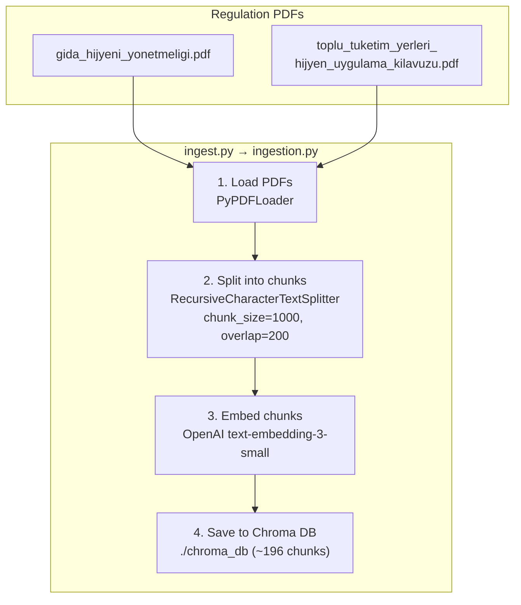
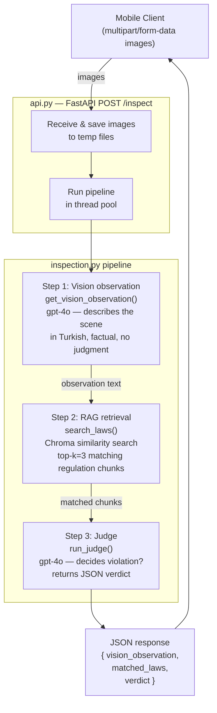
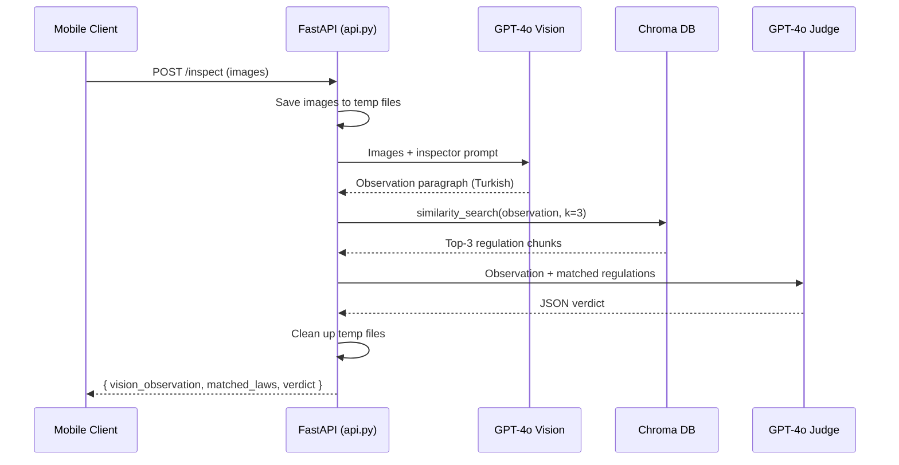

# Health Inspector — System Overview

A proof-of-concept that automatically inspects kitchen / food-preparation areas for regulatory violations. A mobile client sends photos; the system uses computer vision, vector-database retrieval, and an LLM judge to decide whether Turkish food-safety regulations are violated and explains why.

---

## Table of Contents

1. [Big Picture](#big-picture)
2. [Phase 1 — Ingestion (one-time setup)](#phase-1--ingestion-one-time-setup)
3. [Phase 2 — Inspection (per request)](#phase-2--inspection-per-request)
4. [Data Flow End-to-End](#data-flow-end-to-end)
5. [Project Structure](#project-structure)
6. [Key Configuration](#key-configuration)
7. [How to Run](#how-to-run)

---

## Big Picture

```
┌──────────────────────────────────────────────────────────────────┐
│                        OFFLINE  (run once)                       │
│                                                                  │
│   PDF regulations  ──►  chunk  ──►  embed  ──►  Chroma DB        │
└──────────────────────────────────────────────────────────────────┘
                                                   │
                                                   │ persisted to disk
                                                   ▼
┌──────────────────────────────────────────────────────────────────┐
│                        ONLINE  (per request)                     │
│                                                                  │
│  Mobile photos  ──►  Vision LLM  ──►  RAG search  ──►  Judge     │
│                       (describe)     (find laws)    (verdict)    │
└──────────────────────────────────────────────────────────────────┘
```

There are two completely independent phases:

- **Ingestion** — happens once (or whenever regulations change). Reads PDFs, splits them into chunks, embeds each chunk, and stores everything in a local Chroma vector database.
- **Inspection** — happens on every client request. Takes photos, gets a factual scene description from a vision model, retrieves the most relevant regulation chunks, and asks an LLM judge whether a violation occurred.

---

## Phase 1 — Ingestion (one-time setup)



### What happens step by step

| Step  | Code                      | Detail                                                                                                                                                        |
| ----- | ------------------------- | ------------------------------------------------------------------------------------------------------------------------------------------------------------- |
| Load  | `load_pdfs()`             | `PyPDFLoader` reads each PDF page-by-page and attaches the source filename as metadata.                                                                       |
| Split | `split_documents()`       | `RecursiveCharacterTextSplitter` breaks pages into overlapping chunks (1 000 chars, 200-char overlap) so no regulation clause is cut off at a chunk boundary. |
| Embed | `save_documents_to_db()`  | Each chunk is turned into a vector using OpenAI's `text-embedding-3-small` model.                                                                             |
| Store | `Chroma.from_documents()` | Vectors + text + metadata are written to a local Chroma database on disk. The DB is wiped first so re-running ingest never creates duplicates.                |

**Run:** `uv run ingest.py`

---

## Phase 2 — Inspection (per request)



### Step 1 — Vision Observation

- Each uploaded image (HEIC, JPEG, PNG, …) is decoded by `pillow-heif` / Pillow and converted to base64 JPEG.
- All images are sent together in a single call to `gpt-4o` with a carefully worded prompt.
- The prompt instructs the model to act as an **inspector filling a record** — it describes only what is visually present (surfaces, equipment, materials, layout) without making judgments or recommendations.
- Output: a plain Turkish paragraph that other steps can reason about.

### Step 2 — RAG Retrieval

- The observation paragraph from Step 1 is embedded with the same `text-embedding-3-small` model used during ingestion.
- Chroma returns the top-3 regulation chunks whose embeddings are closest to the observation's embedding.
- These chunks come from the Turkish food-hygiene regulations and are passed verbatim to the judge.

### Step 3 — Judge

- `gpt-4o` receives the observation text and the 3 retrieved regulation chunks.
- The prompt asks: "Is this a violation? Why? Under which regulation?"
- The model returns a structured JSON object:

```json
{
  "violation": true,
  "explanation": "...",
  "risk_level": "Orta",
  "mevzuat": "3.1.7 Temizlik Gereçlerinin Muhafazası"
}
```

---

## Data Flow End-to-End



---

## Project Structure

```
health-inspector/
│
├── ingest.py                          # CLI: run ingestion pipeline once
├── main.py                            # CLI: run inspection pipeline locally
├── api.py                             # FastAPI HTTP server
│
├── src/health_inspector/
│   ├── config.py                      # All tunable settings in one place
│   ├── ingestion.py                   # load_pdfs, split_documents, save_documents_to_db
│   └── inspection.py                  # load_database, get_vision_observation,
│                                      #   search_laws, run_judge
│
├── resources/
│   ├── gida_hijyeni_yonetmeligi.pdf
│   ├── toplu_tuketim_yerleri_hijyen_uygulama_kilavuzu.pdf
│   └── images/                        # Sample HEIC photos for local testing
│       ├── IMG_4047.HEIC
│       ├── IMG_4048.HEIC
│       └── IMG_4049.HEIC
│
├── chroma_db/                         # Persisted vector database (git-ignored)
├── docs/
│   └── HEALTH_INSPECTOR.md            # This file
└── pyproject.toml                     # Dependencies (uv)
```

---

## Key Configuration

All settings live in `src/health_inspector/config.py`:

| Setting           | Value                    | Purpose                                         |
| ----------------- | ------------------------ | ----------------------------------------------- |
| `EMBEDDING_MODEL` | `text-embedding-3-small` | Used for both ingestion and RAG search          |
| `VISION_MODEL`    | `gpt-4o`                 | Describes the kitchen scene from images         |
| `LLM_MODEL`       | `gpt-4o`                 | Judge that evaluates violations                 |
| `LLM_TEMPERATURE` | `0`                      | Deterministic outputs for both models           |
| `CHUNK_SIZE`      | `1000`                   | Max chars per regulation chunk                  |
| `CHUNK_OVERLAP`   | `200`                    | Overlap to avoid cutting regulation clauses     |
| `DEFAULT_TOP_K`   | `3`                      | Number of regulation chunks retrieved per query |
| `DB_PATH`         | `./chroma_db`            | Where Chroma persists its data                  |

---

## How to Run

### 1. Set up environment

```bash
# Install dependencies
uv sync

# Create a .env file with your OpenAI key
echo "OPENAI_API_KEY=sk-..." > .env
```

### 2. Ingest regulations (one time)

```bash
uv run ingest.py
# Loads PDFs → splits → embeds → saves ~196 chunks to chroma_db/
```

### 3a. Run inspection locally (CLI)

```bash
uv run main.py
# Uses the sample HEIC images in resources/images/
# Prints observation, matched laws, and verdict to the terminal
```

### 3b. Run as an HTTP API (for mobile clients)

```bash
uv run uvicorn api:app --reload --host 0.0.0.0 --port 8000
```

Send images from any client:

```bash
curl -X POST http://localhost:8000/inspect \
  -F "images=@photo1.heic" \
  -F "images=@photo2.heic"
```

Interactive API docs are available at `http://localhost:8000/docs`.
